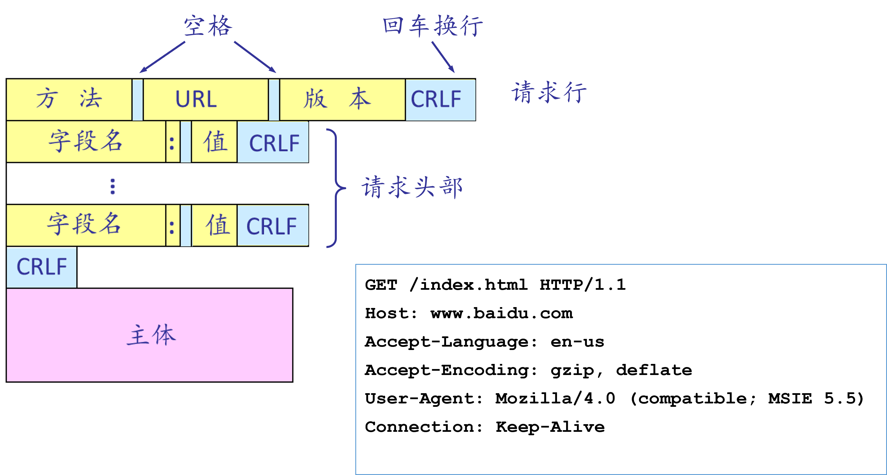
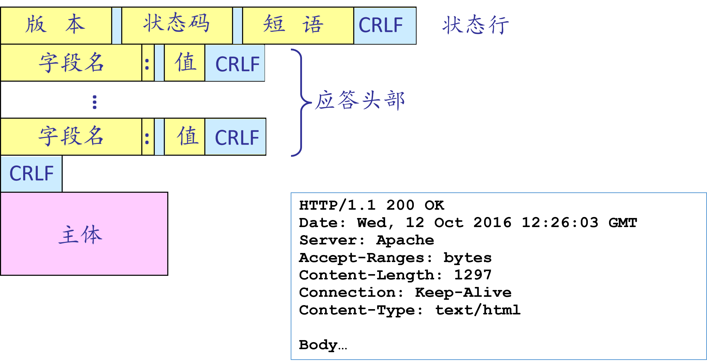
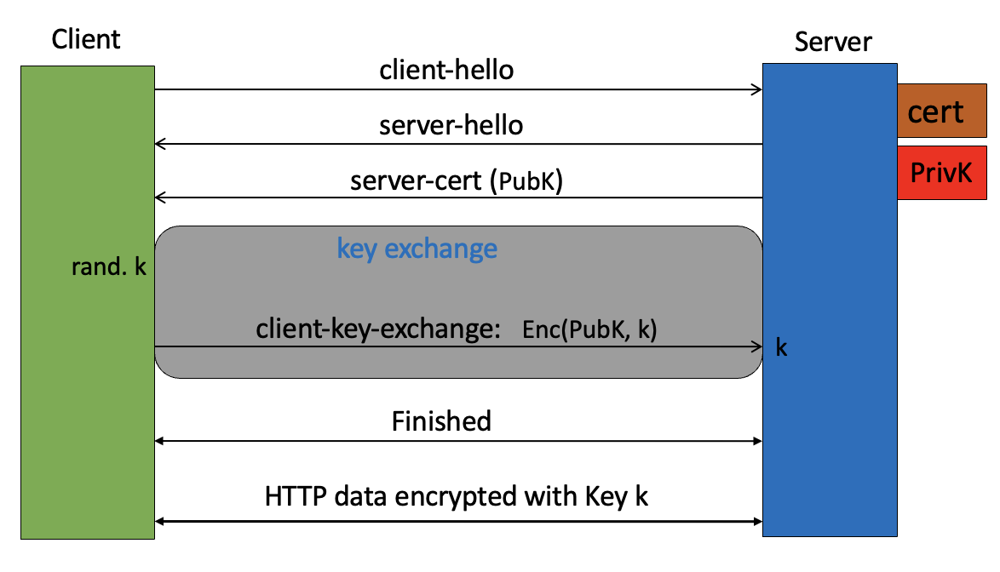

## HTTP服务器实验报告

**蔡洛姗 陈飞羽**

### 一、实验内容

使用C语言实现最简单的HTTP服务器，满足以下要求：

1. 分别使用两个线程监听，同时支持HTTP（80端口）和HTTPS（443端口）；

2. 支持GET方法，解析请求报文，返回相应应答及内容，需要支持的状态码包含：

   | 状态码                   | 说明                                                         |
   | ------------------------ | ------------------------------------------------------------ |
   | **200 OK**               | 对于443端口接收的请求，如果程序所在文件夹存在所请求的文件，返回该状态码，以及所请求的文件 |
   | **301 Moed Permanently** | 对于80端口接收的请求，返回该状态码，在应答中使用Location字段表达相应的https URL |
   | **206 Partial Content**  | 对于443端口接收的请求，如果所请求的为部分内容（请求中有Range字段），返回该状态码，以及相应的部分内容 |
   | **404 Not Found**        | 对于443端口接收的请求，如果程序所在文件夹没有所请求的文件，返回该状态码 |

3. 要求能够通过test.py测试，并且用该HTTP服务器传输视频文件到VLC客户端。

   

### 二、实验基础

Ps:这一部分是否需要精简一点，图片可以换成较为清晰的PPT里的版本？

1. HTTP协议

   超文本传输协议（英语：HyperText Transfer Protocol，缩写：HTTP）是一种用于分布式、协作式和超媒体信息系统的应用层协议。通过HTTP或者HTTPS协议请求的资源由统一资源标识符（Uniform Resource Identifiers，URI）来标识。本次实验选取了HTTP/1.1版本的协议。HTTP/1.1默认采用持续连接（Connection: keep-alive），可以在一次连接中传输多次数据。

   通常，由HTTP客户端发起一个请求，创建一个到服务器指定端口（默认80端口）的TCP连接。HTTP服务器则在那个端口监听客户端的请求。一旦收到请求，服务器会向客户端返回一个状态，比如"HTTP/1.1 200 OK"，以及返回的内容，如请求的文件、错误消息或者其它信息。

   HTTP协议的请求报文由请求行、请求头部、空行和请求数据4个部分组成。请求行包括请求方法（本实验仅支持GET方法）、URL、协议版本，中间以空格隔开，以回车符和换行符作为结尾。请求头部（1行或多行）由关键字/值对组成，每行一对，关键字和值用英文冒号“:”分隔。请求头部可以用于通知服务器有关于客户端请求的信息，如客户端可接受的文件类型、请求的主机名等。空行用于通知服务器请求头部的结束。请求数据不在GET方法中使用。具体的请求报文格式如图1所示。

   
   <center>
   图1 HTTP请求报文
   </center>                                                               
   HTTP协议的响应报文由状态行、响应头、空行和响应体4个部分组成。状态行由协议版本号、状态码、状态消息组成，中间以空格隔开。响应头由0或多个字段组成，允许服务器传递超出状态行的附加信息，充当响应修饰符。它们提供有关服务器或有关进一步访问目标资源或相关资源的信息。空行用于通知客户端响应头的结束。响应数据为请求文件的内容。当响应状态(Response Status)为1xx/204/304，响应正文长度为0；如果使用了非"identity"的Transfer-Encoding编码方式,则响应正文长度由"chunked"编码决定,除非该消息以连接关闭为结束；如果存在"Content-Length"相应头,则响应正文长度为该数值。具体响应报文格式如图2所示。
   
   <center>图2 响应报文格式</center>

1. HTTPS协议

   安全超文本传输协议(HTTPS)是超文本传输协议(HTTP)的扩展，用于计算机网络上的安全通信。在HTTPS（默认443端口）中，通信协议使用传输层安全性（TLS）或安全套接字层（SSL）进行加密。HTTPS 的主要作用是对访问的网站进行身份验证以及在传输过程中保护交换数据的隐私和完整性。

   HTTP协议和安全协议同属于应用层（OSI模型的最高层），具体来讲，安全协议工作在HTTP之下，传输层之上：安全协议向运行HTTP的进程提供一个类似于TCP的套接字，供进程向其中注入报文，安全协议将报文加密并注入运输层套接字；或是从运输层获取加密报文，解密后交给对应的进程。严格地讲，HTTPS并不是一个单独的协议，而是对工作在一加密连接（TLS或SSL）上的常规HTTP协议的称呼。服务器必须使用一个受信任机构签发的公钥证书。客户端会验证证书的合法性，如果验证通过才会进行后续通信，否则根据错误情况不同做出提示和操作本实验采用SSL加密。

2. Socket API

   Socket（套接字）是用户进程和网络之间的统一接口。“IP+端口+协议”的组合就可以唯一标识网络中一台主机上的一个进程，这也是Socket的主要参数。Socket可以看成在发送端与接受端进行通讯连接中的端点。

3. SSL协议

   SSL是一个不依赖于平台和运用程序的协议，位于TCP/IP协议与各种应用层协议之间，为数据通信提高安全支持。SSL的体系结构中包含两个协议子层，其中底层是SSL记录协议层（SSL Record Protocol Layer）；高层是SSL握手协议层（SSL HandShake Protocol Layer）。

   SSL握手层协议用于SSL管理信息的交换，允许应用协议传送数据之间相互验证，协商加密算法和生成密钥等。SSL记录协议层的作用是为高层协议提供基本的安全服务，具体实施压缩解压缩、加密解密、计算和校验MAC等与安全有关的操作。

   

### 三、设计实现

#### （一）HTTP (80端口) 服务器实现

​	服务器是被动建立连接的一方，由一个线程将HTTP服务器的socket文件描述符与监听地址绑定并监听，接受客户端的连接请求，随后解析HTTP请求并回复HTTP应答，然后关闭连接，完成一次通信。我们要实现的HTTP服务器只需要对GET请求返回 301 Moed Permanently 响应，Location字段为相应的https URL，表示永久重定向，目标网页已经永久性地转移到了对应的https 地址。这是为了便于后续对HTTPS服务器进行测试，通过HTTP请求重定向到对HTTPS服务器发出请求，得到真正的响应。

1. 首先，在主函数中创建一个线程负责监听HTTP(80端口)，HTTPS(443端口)也是一样：

   ```c
   int main(int argc, const char *argv[]){
       // create 2 threads for listening 80 and 443 ports
       pthread_t new_thread_80;
       pthread_t new_thread_443;
       if (pthread_create(&new_thread_80, NULL, Create_80_port, NULL) != 0)
           perror("pthread_create failed!");
       if (pthread_create(&new_thread_443, NULL, Create_443_port, NULL) != 0)
           perror("pthread_create failed!");
       while(1){
       	sleep(1);
       }
       return 0;
   }
   ```

2. 在80端口中，先创建自己一方的socket文件描述符；设置服务器端的地址信息，将socket文件描述符与监听地址绑定，并进行监听:

   ```c
   void *Create_80_port(void * no){
       int s, cs;
       struct sockaddr_in server, client;
       // create socket
       if ((s = socket(AF_INET, SOCK_STREAM, 0)) < 0) {
           perror("create socket failed!");
           fflush(stdout);
   				return NULL;
       }
       // prepare the sockaddr_in structure
       int port_num =  80;
       server.sin_family = AF_INET;
       server.sin_addr.s_addr = INADDR_ANY;
       server.sin_port = htons(port_num);  
       // bind socketfd with the addr
       if (bind(s,(struct sockaddr *)&server, sizeof(server)) < 0) {
           perror("bind failed!");
           fflush(stdout);
           return NULL;
       }
       // listen
       listen(s, 100);
       printf("waiting for incoming connections...\n");
   ```

3. 随后为了支持多路并发和客户端多次请求，服务器用一个while循环来不断接收连接请求，每接收一个请求就创建一个对应线程来负责处理：

   ```c
       while (1)
       {
           // accept connection from an incoming client
           int c = sizeof(struct sockaddr_in);
           if ((cs = accept(s, (struct sockaddr *)&client, (socklen_t *)&c)) < 0) {
               perror("accept failed!");
               fflush(stdout);
               return NULL;
           }
           // create a thread to handle the request
           pthread_t new_thread;
           if (pthread_create(&new_thread, NULL, Handle_HTTP_Request, cs) != 0)
               perror("pthread_create failed");
       }
   }
   ```

4. 在HTTP请求处理函数中，先接收并解析HTTP请求报文（例如 GET /index.html HTTP/1.1\r\n Range: bytes=100-200\r\n ...），从请求行中获取URL文件路径；然后将原路径修改为相应的https URL，按照HTTP响应格式返回 301 Moved Permanently，其中Location字段为修改后的https URL；最后关闭连接，结束一次通信。

   ```c
   void *Handle_HTTP_Request(int csock){
       char msg[256];
       int msg_len = 0;
       while ((msg_len = recv(csock, msg, sizeof(msg), 0)) > 0) {
           char path[50];
           char url[100];   
           memset(path,0,sizeof(path));
           printf("%s\n",msg);
           get_path(msg, path);
           strcpy(url,"https://10.0.0.1");
           strcat(url,path);
           /* ******************************* 
            * respond with 301 new location:  
            * HTTP/1.1 301 Moved Permanently
            * Location: https://10.0.0.1/index.html
            * *******************************/
           char buf[1024];
           strcpy(buf, "HTTP/1.1 301 Moved Permanently\r\n");
           strcat(buf, "Location: ");
           strcat(buf,url);
           strcat(buf,"\r\n\r\n\r\n");
           printf("%s\n",buf);
           write(csock, buf, strlen(buf));
   
           // close server socket
           close(csock);
       }     
   }
   
   void get_path(char *msg,char *path){
       char *ptr;
       ptr=strstr(msg,"/");
       int i=0;
       while(*ptr!=' '){
           path[i]=*ptr;
           ptr++;i++;
       }
       path[i]='\0';
   }
   ```

   

#### （二）HTTPS (443端口)服务器实现

​	HTTPS服务器需要在HTTP实现socket连接的基础上，增加一层SSL加密验证，从而保障互联网传输的安全。Socket使用SSL/TLS通信对http报文进行加密的整体流程如下图所示：


<center>SSL连接流程</center>

此外，我们的HTTPS服务器需要在实现加密通信的条件下，解析HTTP请求并在当前文件夹内查找对应文件，能够回复三种HTTP应答（200 OK、206 Partial Content、404 Not Found）和对应的文件数据。

1. 在443端口中，首先初始化SSL环境，并创建SSL上下文，加载服务器端的证书（公钥）和私钥；然后和HTTP服务器一样创建TCP通信端口连接；接下来根据SSL上下文创建SSL，并且将SSL与Socket相关联；随后开始执行上图中展示的SSL握手；握手成功之后就可以进行SSL加密的数据读写通信；最后关闭SSL连接和Socket连接，释放SSL上下文，结束通信。代码如下：

   ```c
   void *Create_443_port(void * no){
       // init ssl certification
       SSL_CTX *ctx = InitSSL();
       if(ctx==NULL){
           perror("init ssl error!");
           return NULL;
       }
       // create socket
       ......
       // prepare the sockaddr_in structure
       ......
       // bind socketfd with the addr
       ......
       // listen
       ......
       
       SSL *ssl;
       while (1)
       {
           // accept connection from an incoming client
           int c = sizeof(struct sockaddr_in);
           if ((cs = accept(s, (struct sockaddr *)&client, (socklen_t *)&c)) < 0) {
               perror("accept failed!");
               fflush(stdout);
               return NULL;
           }
   
           // create ssl connection
           ssl = SSL_new(ctx);
           if(ssl == NULL){
               perror("ssl new wrong!");
               return NULL;
           }
           SSL_set_accept_state(ssl);
           // connect ssl with socket fd
           SSL_set_fd(ssl, cs);
           // ssl handshake
           if (SSL_accept(ssl) == -1){
               perror("ssl get error!");
               return NULL;
           }      
           // create a thread to handle ssl_read/write
           pthread_t new_thread;
           struct param param1 = {ssl,cs};
           if (pthread_create(&new_thread, NULL, Handle_HTTPS_Request, &param1) != 0)
               perror("pthread_create failed");
       }
   
       // ssl shutdown
       SSL_shutdown(ssl);
       SSL_free(ssl);
       // close server socket
       close(cs);
       SSL_CTX_free(ctx);
   }
   
   SSL_CTX * InitSSL(){
       // init ssl environment
       SSL_library_init();
       SSL_load_error_strings();
       // create ssl context
       SSL_CTX *ctx = SSL_CTX_new(SSLv23_method());
       // load server's cert and private key
       SSL_CTX_use_certificate_file(ctx, "./keys/cnlab.cert", SSL_FILETYPE_PEM);
       SSL_CTX_use_PrivateKey_file(ctx, "./keys/cnlab.prikey", SSL_FILETYPE_PEM);    
       // 判定私钥是否正确  
       assert(SSL_CTX_check_private_key(ctx));
   
       return ctx;
   }
   ```

2. 在HTTPS请求处理函数中，需要先接收并解析HTTP请求报文，从请求行中获取URL，从请求头部获取Range等信息；然后查找服务器目录下是否存在URL对应路径的文件，若没找到，则用 `SSL_write()` 方法按响应格式返回 404 File Not Found，若找到，则根据请求中的Range字段，按响应格式返回 200 OK 或 206 Partial Content，以及文件的相应部分数据。代码如下：

   ```c
   void *Handle_HTTPS_Request(void *args){
       struct param *p = (struct param *)args;
       SSL *ssl = (*p).ssl;
       int csock = (*p).csock;
       char msg[256];
       int msg_len = 0;
       if((msg_len = SSL_read(ssl, msg, sizeof(msg))) > 0) { // receive message
           /* parse the request */
           char *str_start = NULL;
           int range_start = -1;
           int range_end = -1;
   
           char path[50];
           memset(path,0,sizeof(path));
           path[0]='.';   
           printf("%s\n",msg);
         	get_path(msg, path+1);
         
           str_start = strstr(msg,"Range");
           if (str_start != NULL){
               str_start += 13;
               char tmp[10];
               int i=0;
               while (*str_start != '-'){
                   tmp[i++]=*str_start;
                   str_start++;     
               }
               tmp[i]='\0';
               range_start=atoi(tmp);
               i=0;str_start++;
               while (*str_start != '\r'){
                   tmp[i++]=*str_start;
                   str_start++;     
               }
               if (i!=0){
                   tmp[i]='\0';
                   range_end=atoi(tmp)+1;
               }
           }
           
           /* look up the file and make response */
           https_serve_response(ssl,path, range_start, range_end);      
       }
   }
   
   void https_serve_response(SSL *ssl,char *filename, int range_start, int range_end)
   {   
       FILE *file = NULL;
       struct stat file_stat;
       char buf[1024];
       char *buffer = NULL;
       memset(buf,0,1024);
       if (stat(filename, &file_stat) == -1) {
           /*no such file*/
           strcpy(buf, "HTTP/1.1 404 File Not Found\r\n");
       		strcat(buf,"Server: 10.0.0.1\r\n");
           strcat(buf,"Connection: close\r\n");
           strcat(buf,"Content-Length: 0\r\n");
       		strcat(buf,"\r\n");
       		SSL_write(ssl, buf, strlen(buf));
       }else {
           if((file = fopen(filename, "r"))==NULL){
               perror("open failed");
   		    		return;
           }
           fseek(file, 0, SEEK_END);
           int st_size = ftell(file);
           int state_range = 0;
           if(range_start != -1){
               if(range_end != -1)
                   st_size = range_end - range_start;
               else{
               	range_end = st_size;
                   st_size = st_size - range_start;
               }
               state_range = 1;
           }else{
               range_start = 0;
               if(range_end != -1)
                   st_size = range_end - range_start;
               else{
               		range_end = st_size;
                   st_size = st_size - range_start;  
               }
           }
           fseek(file, 0, 0);  
           /*send HTTP header */
           buffer = (char *)malloc(2000);
           memset(buffer,0,2);
           if(!state_range)
           	strcpy(buffer, "HTTP/1.1 200 OK\r\n");
           else
           	strcpy(buffer, "HTTP/1.1 206 Partial Content\r\n");
           sprintf(buf, "Content-Length: %d\r\n",st_size); 
           strcat(buffer,buf);
           strcpy(buf,"Server: 10.0.0.1\r\n");
           strcat(buffer,buf);
           strcat(buffer,"\r\n");
           SSL_write(ssl, buffer, strlen(buffer));
           
         	/*send file body*/
           cat(file, range_start, range_end,csock);
           fclose(file);
           free(buffer);
       }
   }
   ```

3. 发送文件数据时，用`fseek()`找到要读取的文件范围，用`fread()`每次读取一定大小（这里我们设置的缓冲区大小为1024 byte）的数据块，依次发送给客户端，代码如下:

   ```c
   void cat(SSL *ssl, FILE *resource, int range_start, int range_end)
   {
   	int total_size = range_end - range_start;
   	int send_size = 0;
   	fseek(resource,range_start,SEEK_SET);
   	char buf[1024];
   	while(send_size < total_size){
   		if(total_size - send_size >= 1024){
   			send_size+=fread(buf,1,1024,resource);
   			SSL_write(ssl,buf,1024);
   		}else{
   			int sz = total_size - send_size;
   			send_size+=fread(buf,1,total_size - send_size,resource);
   			SSL_write(ssl,buf,sz);
   		}
   	}
   }
   ```

   

### 四、测试结果

1. Test.py

   Test1 http请求，发送到80端口，返回301 得到新的location: https url（抓包，运行结果截图）

   。。。。。

### 五、视频传输流程分析

老师的PPT-06里面有相关的介绍，可以参考。

这里可以讲一下对于视频传输代码修改的部分（http，文件type之类的）


#### 参考资料

RFC 7230, HTTP/1.1: Message Syntax and Routing

RFC 7231, HTTP/1.1: Semantics and Content

RFC 7232, HTTP/1.1: Conditional Requests

RFC 7233, HTTP/1.1: Range Requests

RFC 7234, HTTP/1.1: Caching

RFC 7235, HTTP/1.1: Authentication